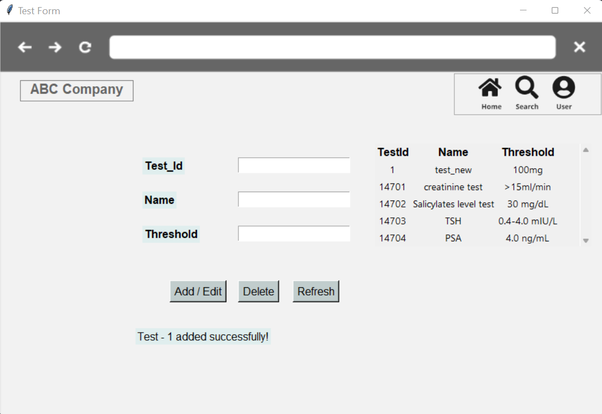

# clinical_trial_management_system
Relational Database Management System for Clinical Trials

## Business Rules
ABC Hospital is having an opening to pitch a new database for its clinical studies. The main objective of the database is to make it easier for researchers to analyze and track activities in the study. For privacy and security reasons we need a more reliable database system. They wish to track the clinical studies being conducted through all 4 phases. They note down patients' demographics (name, age, gender, address, and email address), and assign them the study. The study includes a set of employees having different roles, such as nurses (who would administer drugs to the participant), physician (who would look at the results of the tests), an admin, and other researchers conducting the study. 

For each study, they wish to track the name of the study, its type, inclusion and exclusion criteria and the drug of interest. Through each phase, the dosage and frequency of the drug keep changing for testing purposes. Participants are divided into 3 groups based on the drug they’re being administered. The drug could be the drug of interest, an existing drug for comparing outcomes, and a placebo drug. Each patient can only receive one of these drugs. The existing drug would keep changing as and when the phase changes. For example, in phase 1, our drug is being tested against drug ABC which is already out on the market, it will be tested against a different drug, say drug XYZ, in phase 2. 

The drugs given will be tested at different stages of the trial and the test results will be used to analyze the effect of the trial. Each study will have a certain number of participants and a set of employees. One participant cannot be a part of more than one clinical study at a time, however, an employee can be a part of multiple clinical studies simultaneously albeit in the same role. Additionally, one drug can be a part of multiple clinical studies, but one clinical study can only have one drug of interest.

## ER Diagram

## Creating tables and Inserting values
- [Clinical Trial DB](./Clinical%20Trial%20DB/Clinical%20Trial%20DB/) consists of SQL scripts for table setup and value insertion.

## GUI - Test table

- Added code to get a GUI for adding, editing, deleting, and viewing the Test table.

## SQL Queries for Extracting Analytical Information
Queries can be found in the [queries](./Clinical%20Trial%20DB/Clinical%20Trial%20DB/Queries.sql)
* Retrieve the average age of male and female participants, along with the count of participants in each gender category
* Retrieve the total number of Participants in each study
* Retrieve a list of participants along with the test details and the participants' test results
* Display the total number of drug administrations for each study type (e.g., Clinical Trial, Observational, Experimental)
* Display both DOI and Existing Drugs being compared to those involved in each Study
* Display the distribution of Participants across different cities

